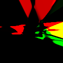
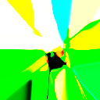
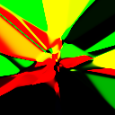

## lfmnn

 

Repository for stuff related to machine learning. Focused around last.fm and
Neural Networks.

## commands

There are some commands in the `cmd/` folder. They do the following:

### load

Wrapper for the [_load_](#load) package.

Start with `./b run load`.

### stat

Loads the tag statistics fetched with _load_ and displays them using
[_bars_](#bars).

Start with `./b run stat`.

### testnn

Play-around command for using the [_ffnn_](#ffnn) package. Can generate images
or graphs.

Generates images to `image-<number>.png`

Start with `./b run testnn`.

### fmnn

Should at some point use the tags loaded from last.fm to generate a user profile
with ffnn.

Start with `./b run fmnn`.

## packages

This repository is comprised of a few packages:

### bars

A simple ncurses-like CLI for displaying a set of _(string, float)_ tuples
and scrolling through them.

### ffnn

Simplistic Feed-Forward Neural Network.

### load

A last.fm tracks and tags scraper.

#### setup

1. Get last.fm API keys
2. Run once: `./b run load`
3. Open up `config.json`, fill in apikey, secret and last.fm username
4. Run again: `./b run load`  
   This will take some time.

When finished, open up `tracks-{your username}.json`.
Warning: this file will be big.

## contact / usage

These packages are available for your pleasure. If you find them particularly
interesting or for some other reason want to contact me, feel free!

c _ät_ cfs.im

## license

GNU GPLv3.
